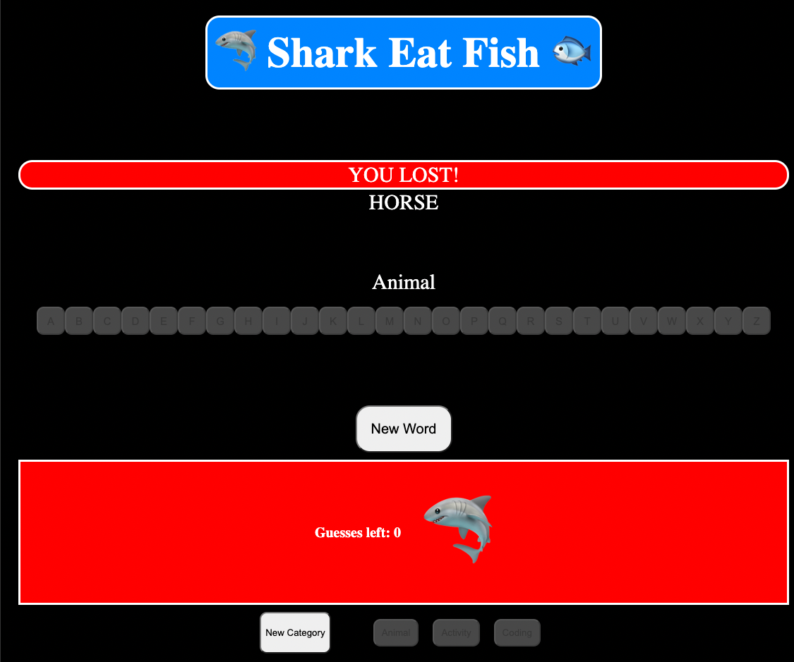

# Shark Eat Fish! (Hangman)

## Date: 7/2/2022

### By: John Dunn

[Instagram](https://www.instagram.com/the_alch3mys7/) |
[Facebook](https://www.facebook.com/chimp.slap/) |
[Linked-In](https://www.linkedin.com/in/john-michael-dunn-522b84243/) |
[Trello](https://trello.com/b/1ISeV99H/project-1)

---

## **_Description_**

The age-old classic with a new theme! Exercise your vocabulary knowledge!
Don't let the shark eat the fish, and ultimately... YOU!
Can you guess the word?? Or will you become shark bait?

---

## **_Technologies Used_**

1. Javascript
2. HTML
3. CSS

---

## **_Getting Started_**

Choose a category at the bottom.

Press Start Game!

For a new word in the same category, press New Word.

Select new category to change the topic!

Simply guess the hidden word, by clicking on the letters provided.

---

## **_Screenshots_**

### **_Main Board_**

### **_Win Condition_**

### **_Lose Condition_**

---

## **_Future Updates_**

- [x] Functional Game
- [x] Shark Theme
- [x] Choose a category!

---

## **_Credits_**

ME

_Coding Lessons:_ _General Assembly_ **Instructors:** _John A. Jacobs_ _Michael Lackey_

_Markdown Cheatsheet:_ _Github_
